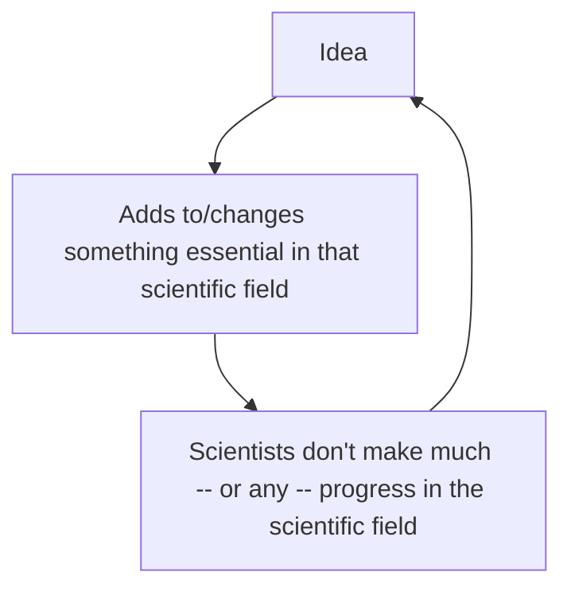

# *Structure* Questions Chapter 2

1. List at least five ways that paradigms help scientific communities. 

* Allowed information to be spread better because the paradigm's "achievement was sufficiently unprecedented to attract an enduring group of adherents away from competing modes of scientific activity"
* Allowed for scientific progress after the paradigm because "it was sufficiently open-ended to leave all sorts of problems for the redefined group of practitioners to resolve."
* Discourages disagreement and therefore inefficiency in the specific scientific field because everybody in the field has learned from the same paradigm already: "Men whose research is based on shared paradigms are committed to the same ruled and standards for scientific practice."
* Easier for people to learn about a scientific field because there are only a few sources of "contemporary" sources that consist of paradigms
* Harder to collect data: "As a result [of the absence of a paradigm], early fact-gathering is a far more nearly random activity..."

2. What is difficult for scientists before there is an accepted paradigm in their field?

* Harder to collect data
* Disagreements between scientists in a scientific field on bottom-line theories

3. Explain the following quote in the context of Kuhn's explanation of the concept of a paradigm:

   > No natural history can be interpreted in the absence of at least some implicit body of intertwined theoretical and methodological belief that permits selection, evaluation, and criticism" (16-17)

   Kuhn is saying that the presence of a paradigm in a field is essential for *any* scientific development to happen simply because new data cannot be interpreted without a framework already in place. 

4. Explain the process of paradigm creation. Include a visual/diagram to explain the multi-stage process (can do by hand and attach a picture if that is easier for you). 

